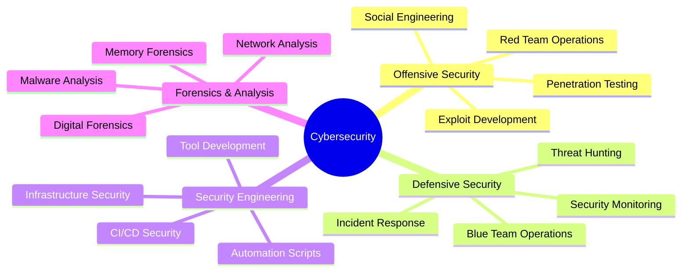

<div align="center">

# ⚡ DEFENDER OF THE DIGITAL REALM

[](https://sujallamichhane.com.np)
[](https://www.linkedin.com/in/sujal-lamichhane/)
[](mailto:infokaalbhairav@gmail.com)


</div>


<p align="center">
  
</p>

<div align="center">
  
```ascii
╔═══════════════════════════════════════════════════════════════════╗
║  🛡️  CLEARANCE LEVEL: AUTHORIZED  |  STATUS: ACTIVE  |  🔐       ║
║  THREAT LEVEL: MONITORING  |  SYSTEMS: OPERATIONAL  |  ⚠️        ║
╚═══════════════════════════════════════════════════════════════════╝
```

</div>

---


<div align="center">

## 🧠 SECURITY PROFILE: SUJAL_LAMICHHANE

</div>

```console
┌──(root㉿DEFENSE-NODE)-[~/profile]
└─$ cat identity.txt

> STATUS: ACTIVE | CLEARANCE: AUTHORIZED | ROLE: CYBER_DEFENDER
```

<table align="center">
<tr>
<td width="50%" valign="top">

### 🎯 MISSION OBJECTIVE

> *"They exploit the system. I exploit their exploits."*

I am **Sujal Lamichhane** — a **Cybersecurity Specialist** and **Certified Ethical Hacker (CEH v13)** operating in the digital shadows.

**My battlefield:** Networks, systems, and the invisible layer between logic and chaos.

**My mission:** To **detect**, **defend**, and **dismantle** digital threats before they strike.

I believe hacking is not crime — it's **clarity**.  
Understanding the system means mastering it, and mastering it means protecting it.

</td>
<td width="50%" valign="top">

### 📡 OPERATIONAL METRICS

```yaml
Role: Cybersecurity Specialist
Certification: CEH v13
Focus Areas:
  - Penetration Testing
  - Threat Intelligence
  - Incident Response
  - Security Automation
  - DFIR (Digital Forensics)
  
Experience:
  Red Team Operations: ████████░░ 80%
  Blue Team Defense:   ██████████ 100%
  Python Automation:   █████████░ 90%
  SOC Operations:      ████████░░ 85%
```

</td>
</tr>
</table>

---


<div align="center">

## ⚔️ CURRENT OPERATIONS

</div>

```console
┌──(root㉿DEFENSE-NODE)-[~/operations]
└─$ ./display_active_missions.sh

[✓] Authorized Red Team & Penetration Testing
[✓] Python Security Tool Development
[✓] AI-Assisted Threat Modeling Research
[✓] SOC Intelligence Workflow Optimization
[!] Status: All Systems Operational
```

<table align="center">
<tr>
<td width="33%" align="center">

### 🔴 RED TEAM OPS
```
▶ Penetration Testing
▶ Vulnerability Assessment
▶ Exploit Development
▶ Social Engineering
```

</td>
<td width="33%" align="center">

### 🔵 BLUE TEAM OPS
```
▶ Threat Detection
▶ Incident Response
▶ Security Monitoring
▶ Log Analysis
```

</td>
<td width="33%" align="center">

### 🟣 PURPLE TEAM OPS
```
▶ Security Automation
▶ Tool Development
▶ Process Optimization
▶ Knowledge Transfer
```

</td>
</tr>
</table>

### 🛠️ ARSENAL - TOOLS & TECHNOLOGIES

<div align="center">

#### 🔐 Security & Pentesting


#### 💻 Programming & Scripting


#### 🔍 SIEM & Security Monitoring


#### 🐧 Operating Systems & Platforms


</div>

<div align="center">
  
</div>

---


<div align="center">

## 🧩 ACTIVE PROJECTS & RESEARCH

</div>

```console
┌──(root㉿DEFENSE-NODE)-[~/projects]
└─$ ls -la active_projects/

drwxr-xr-x 4 root root 4096 Jan 18 2026 unified-soc-framework/
drwxr-xr-x 3 root root 4096 Jan 18 2026 multi-layer-siem-integration/
```

<details>
<summary><b>🔐 PROJECT #1: UNIFIED OPEN-SOURCE SOC FRAMEWORK</b></summary>

<br>

### 📋 Overview
A comprehensive Security Operations Center (SOC) framework built entirely with open-source tools, integrating network security, SIEM, SOAR, threat intelligence, incident response, and EDR into a single, automated security architecture.

### 🎯 Project Objectives
```yaml
Status: Production Ready [██████████] 100%
Type: Enterprise-Grade SOC Implementation
Scale: Scalable, Modular, Cost-Effective
Target: Educational, Research, SME Environments
```

**Core Capabilities:**
- ✅ Real-time security threat detection
- ✅ Threat intelligence enrichment
- ✅ Automated response actions
- ✅ Efficient incident management
- ✅ End-to-end visibility across network and endpoints

### 🏗️ Architecture Components

<table>
<tr>
<td width="50%" valign="top">

#### 🔐 Network & Perimeter Security
- **pfSense Firewall** - Network gateway and traffic control
- **Suricata IDS/IPS** - Deep packet inspection
- **IOC-based blocklists** - Threat mitigation

#### 🧠 SIEM & SOAR (DMZ)
- **Wazuh** - Log collection, correlation, detection
- **SOAR Automation** - Incident handling workflows

#### 🌐 Threat Intelligence
- **VirusTotal** - File/URL reputation
- **MISP** - Threat sharing platform
- **AbuseIPDB** - IP reputation
- **AlienVault OTX** - Open threat exchange

</td>
<td width="50%" valign="top">

#### 🚨 Incident Response
- **TheHive** - Incident & case management
- **Cortex** - Automated analyzers & responders

#### 💻 Endpoint Security
- **OpenEDR** - Endpoint detection & response
- **Wazuh Agent** - Windows endpoint monitoring

#### 📊 Logging & Alerting
- Centralized logging infrastructure
- **Discord** - Real-time alert notifications

#### 🚫 Automated Response
- Auto-blocking (severity > 7)
- Dynamic pfSense rule updates
- Zero-touch threat mitigation

</td>
</tr>
</table>

### 🔄 Data Flow Architecture

```
┌─────────────────────────────────────────────────────────────┐
│                     DATA FLOW PIPELINE                       │
├─────────────────────────────────────────────────────────────┤
│  1. Network Traffic  →  pfSense + Suricata                  │
│  2. Log Forwarding   →  Wazuh SIEM                          │
│  3. Enrichment       →  Threat Intelligence Platforms       │
│  4. Automation       →  SOAR Workflows                      │
│  5. Case Management  →  TheHive                             │
│  6. Endpoint Action  →  OpenEDR                             │
│  7. Notifications    →  Discord Alerts                      │
│  8. Auto-Response    →  pfSense Firewall Block              │
└─────────────────────────────────────────────────────────────┘
```

### 🎯 Key Features
- **Automated Threat Response** - Severity-based auto-blocking
- **Multi-Source Intelligence** - 4+ threat intel feeds
- **Centralized Management** - Single pane of glass visibility
- **Scalable Architecture** - Modular component design
- **Cost-Effective** - 100% open-source tooling

</details>

<details>
<summary><b>🛡️ PROJECT #2: MULTI-LAYER SECURITY INTEGRATION BASED ON SIEM SOLUTION</b></summary>

<br>

### 📋 Overview
A defense-in-depth security architecture implementing multiple security layers integrated into a centralized SIEM-driven SOC framework. This project simulates real-world attacks, detects threats in real-time, correlates security events, and provides automated alerting.

### 🎯 Project Objectives
```yaml
Status: Operational [██████████] 100%
Type: Multi-Layer Defense Architecture
Approach: Detection, Visibility, Response
Environment: SOC Simulation & Testing
```

**Core Capabilities:**
- ✅ Realistic cyberattack simulation
- ✅ Real-time malicious activity detection
- ✅ Cross-layer log correlation
- ✅ Host-based intrusion detection (HIDS)
- ✅ Automated email alerting
- ✅ Enhanced malware detection via threat intelligence

### 🧱 Architecture Components

<table>
<tr>
<td width="50%" valign="top">

#### 🔥 pfSense (Firewall)
- Network perimeter security
- Traffic filtering & access control
- Network segmentation & routing
- First line of defense

#### 🛡️ Suricata (IDS/IPS)
- Deep Packet Inspection (DPI)
- Signature-based detection
- Anomaly-based detection
- Scan/exploit detection
- SIEM alert forwarding

#### 📊 Wazuh (SIEM / HIDS)
- Centralized log collection
- Event correlation engine
- Rule-based detection
- Behavior-based analysis
- File integrity monitoring
- Rootkit detection
- Real-time dashboards

</td>
<td width="50%" valign="top">

#### 📧 Postfix (Email Server)
- SMTP server configuration
- Real-time security alerts
- Administrator notifications
- Wazuh integration

#### 🧪 Kali Linux (Red Team)
- Attack simulation platform
- Network scanning tests
- Brute-force simulations
- Exploitation attempts
- Credential-based attacks

#### 🧬 VirusTotal Integration
- Wazuh HIDS enhancement
- Suspicious file analysis
- Hash reputation checking
- Malware detection accuracy
- Threat intelligence context

</td>
</tr>
</table>

### 🔄 Security Layers

```
┌─────────────────────────────────────────────────────────┐
│                    Layer 4: Response                    │
│              (Email Alerts via Postfix)                 │
├─────────────────────────────────────────────────────────┤
│                Layer 3: Host Security                   │
│         (Wazuh HIDS + VirusTotal Integration)           │
├─────────────────────────────────────────────────────────┤
│              Layer 2: Network Detection                 │
│              (Suricata IDS/IPS + DPI)                   │
├─────────────────────────────────────────────────────────┤
│               Layer 1: Perimeter Security               │
│              (pfSense Firewall + Rules)                 │
└─────────────────────────────────────────────────────────┘
```

### 🎯 Key Features
- **Defense in Depth** - Multi-layer security approach
- **Real-Time Correlation** - Cross-layer event analysis
- **Automated Alerting** - Instant email notifications
- **Attack Simulation** - Red team testing capabilities
- **Threat Intelligence** - VirusTotal integration for enhanced detection
- **SOC Simulation** - Mirrors real-world SOC environments

### 🧪 Detection Capabilities
```yaml
Network Layer:
  - Port Scans & Reconnaissance
  - Exploitation Attempts
  - Suspicious Traffic Patterns
  - Protocol Anomalies

Host Layer:
  - File Integrity Changes
  - Rootkit Detection
  - Malware Execution
  - Suspicious Process Behavior
  - Authentication Anomalies
```

</details>

<details>
<summary><b>🎓 CERTIFICATIONS & ACHIEVEMENTS</b></summary>

<br>

<div align="center">

| Certification | Issuer | Status | Year |
|--------------|--------|--------|------|
| 🧠 **Certified Ethical Hacker (CEH v13)** | EC-Council | ✅ Active | 2024 |
| 🔐 **Security Operations** | Multiple Platforms | ✅ Active | 2024 |
| 🛡️ **Penetration Testing** | Self-Validated | ✅ Active | 2024 |

</div>

**Core Competencies:**
- ✅ Authorized Penetration Testing & Red Team Operations
- ✅ Security Operations Center (SOC) Management
- ✅ Digital Forensics & Incident Response (DFIR)
- ✅ Threat Intelligence & Analysis
- ✅ Security Tool Development & Automation
- ✅ Network Security & Traffic Analysis

**Platform Experience:**
```
Suricata  ████████████████████  Expert
Wazuh     ████████████████████  Expert
Zabbix    ██████████████████░░  Advanced
OpenEDR   ████████████████░░░░  Intermediate
TheHive   ██████████████████░░  Advanced
```

</details>

<details>
<summary><b>📚 KNOWLEDGE BASE & RESEARCH AREAS</b></summary>

<br>



</details>

---


<div align="center">

## 📊 GITHUB INTELLIGENCE FEED

```console
┌──(root㉿DEFENSE-NODE)-[~/analytics]
└─$ python3 github_monitor.py --user sujallamichhane18

[*] Fetching repository statistics...
[*] Analyzing contribution patterns...
[*] Generating visual reports...
[✓] Analysis complete
```

</div>

<div align="center">
<table>
<tr>
<td width="50%">


</td>
<td width="50%">


</td>
</tr>
</table>


</div>

<div align="center">

### 🏆 GITHUB TROPHY CASE


### 📈 CONTRIBUTION ANALYTICS

<table>
<tr>
<td width="50%">


</td>
<td width="50%">

```yaml
Most Active Time: 🌙 Night Owl
Preferred Languages:
  • Python       ████████████ 45%
  • Bash         ███████░░░░░ 25%
  • JavaScript   █████░░░░░░░ 18%
  • Other        ███░░░░░░░░░ 12%

Commit Pattern:
  Weekend Warrior: ████████░░ 75%
  Week Days:       ██████░░░░ 60%
```

</td>
</tr>
</table>

### 📅 CONTRIBUTION HEATMAP


### 🎯 CODE QUALITY METRICS

[](https://www.codefactor.io/repository/github/sujallamichhane18/sujallamichhane18)


</div>

---


<div align="center">

## ♟️ ETHICAL CODE & OPERATING PRINCIPLES

</div>

```console
┌──(root㉿DEFENSE-NODE)-[~/ethics]
└─$ cat code_of_conduct.txt

═══════════════════════════════════════════════════════════════
                    RULES OF ENGAGEMENT
═══════════════════════════════════════════════════════════════
```

</div>

<table align="center">
<tr>
<td width="33%" align="center">

### 🎯 PURPOSE
```
✓ Strengthen
✓ Educate  
✓ Defend
```

</td>
<td width="33%" align="center">

### 🚫 RESTRICTIONS
```
✗ Unauthorized Access
✗ Data Theft
✗ System Damage
```

</td>
<td width="33%" align="center">

### ⚖️ AUTHORIZATION
```
✓ Legal Permission
✓ Written Consent
✓ Clear Scope
```

</td>
</tr>
</table>

<div align="center">

> ### "The power to exploit is also the power to protect — I always choose protection."

**Core Principles:**

🔐 **Legal Authorization** - All security assessments are performed with explicit written permission  
🛡️ **Responsible Disclosure** - Vulnerabilities are reported through proper channels  
📚 **Knowledge Sharing** - Contributing to the security community through research and education  
🤝 **Ethical Standards** - Adhering to industry best practices and professional codes of conduct  
⚡ **Continuous Learning** - Staying updated with the latest threats, tools, and techniques  

```
┌─────────────────────────────────────────────────┐
│  "Real hackers don't destroy systems —          │
│   they reinforce them."                         │
│                                                  │
│  Every exploit discovered = One system safer    │
│  Every vulnerability patched = Countless saved  │
└─────────────────────────────────────────────────┘
```

**Mission Statement:**  
To leverage offensive security knowledge exclusively for defensive purposes, helping organizations identify and remediate vulnerabilities before malicious actors can exploit them.

</div>

---


<div align="center">

## 🌐 CONTACT & COMMUNICATION CHANNELS

```console
┌──(root㉿DEFENSE-NODE)-[~/contact]
└─$ ./establish_secure_channel.sh

[✓] Encryption enabled
[✓] Secure channel established
[✓] Ready to receive transmission
```

### 📡 DIRECT CHANNELS

<table>
<tr>
<td align="center" width="33%">

### 🕸️ Website
[](https://sujallamichhane.com.np)

Portfolio & Blog

</td>
<td align="center" width="33%">

### 💼 LinkedIn
[](https://www.linkedin.com/in/sujal-lamichhane/)

Professional Network

</td>
<td align="center" width="33%">

### 📧 Email
[](mailto:infokaalbhairav@gmail.com)

Direct Communication

</td>
</tr>
</table>

### 🤝 LET'S COLLABORATE

```yaml
Open To:
  - Security Research Collaboration
  - Penetration Testing Projects
  - Open Source Contributions
  - Knowledge Sharing & Mentorship
  - Speaking Opportunities
  - Vulnerability Disclosure

Response Time: < 24 hours
PGP Available: On Request
```


### 🔔 STAY UPDATED

Want to stay informed about my latest security research and projects?

[](https://github.com/sujallamichhane18)
[](https://sujallamichhane.com.np)

</div>

---


<div align="center">

## 💬 CORE PHILOSOPHY

```
╔══════════════════════════════════════════════════════════════╗
║                                                              ║
║    "Hack Securely. Defend Relentlessly. Learn Endlessly."   ║
║                                                              ║
║         Because real hackers don't destroy systems —         ║
║                  they reinforce them.                        ║
║                                                              ║
╚══════════════════════════════════════════════════════════════╝
```

### 🐍 CONTRIBUTION ACTIVITY


---

### ⚡ QUICK STATS


---

### 🎯 CURRENT MISSION STATUS

```
████████████████████████████████████████ 100% OPERATIONAL
│
├─ Security Research      : [ACTIVE]
├─ Tool Development       : [ACTIVE] 
├─ Threat Monitoring      : [ACTIVE]
├─ Community Contribution : [ACTIVE]
└─ Continuous Learning    : [ALWAYS ON]

Last Updated: 2026-01-18
Next Scheduled Maintenance: Never. We don't sleep.
```

<details>
<summary><b>⚠️ SECURITY NOTICE</b></summary>

<br>

```
┌─────────────────────────────────────────────────────────┐
│ NOTICE TO THREAT ACTORS:                                │
│                                                          │
│ This profile and associated repositories are            │
│ continuously monitored. Any unauthorized access         │
│ attempts will be logged, traced, and reported to        │
│ appropriate authorities.                                │
│                                                          │
│ We believe in responsible security research and         │
│ ethical hacking. If you wish to report a security       │
│ issue, please use responsible disclosure practices.     │
│                                                          │
│ Stay ethical. Stay legal. Stay safe.                    │
└─────────────────────────────────────────────────────────┘
```

</details>

---


```
┌──────────────────────────────────────────────────────────────┐
│                                                              │
│  "In a world of zeros and ones, be the firewall between     │
│   chaos and order. Every line of code, every packet         │
│   analyzed, every vulnerability patched — it all matters."  │
│                                                              │
│  Stay curious. Stay vigilant. Stay secure.                  │
│                                                              │
│  — Sujal Lamichhane                                         │
│                                                              │
└──────────────────────────────────────────────────────────────┘
```


### 📜 LICENSE & ATTRIBUTION

<sub>All code and research shared on this profile is for **educational purposes only**. Unauthorized use of these tools against systems you don't own or have explicit permission to test is **illegal** and **unethical**.</sub>

[](https://opensource.org/licenses/MIT)


</div>


<div align="center">

### ⭐ If you find my work valuable, consider starring my repositories!

<sub>**Last Profile Update:** January 18, 2026 | **Version:** 2.0.0 | **Status:** 🟢 Active</sub>

</div>
